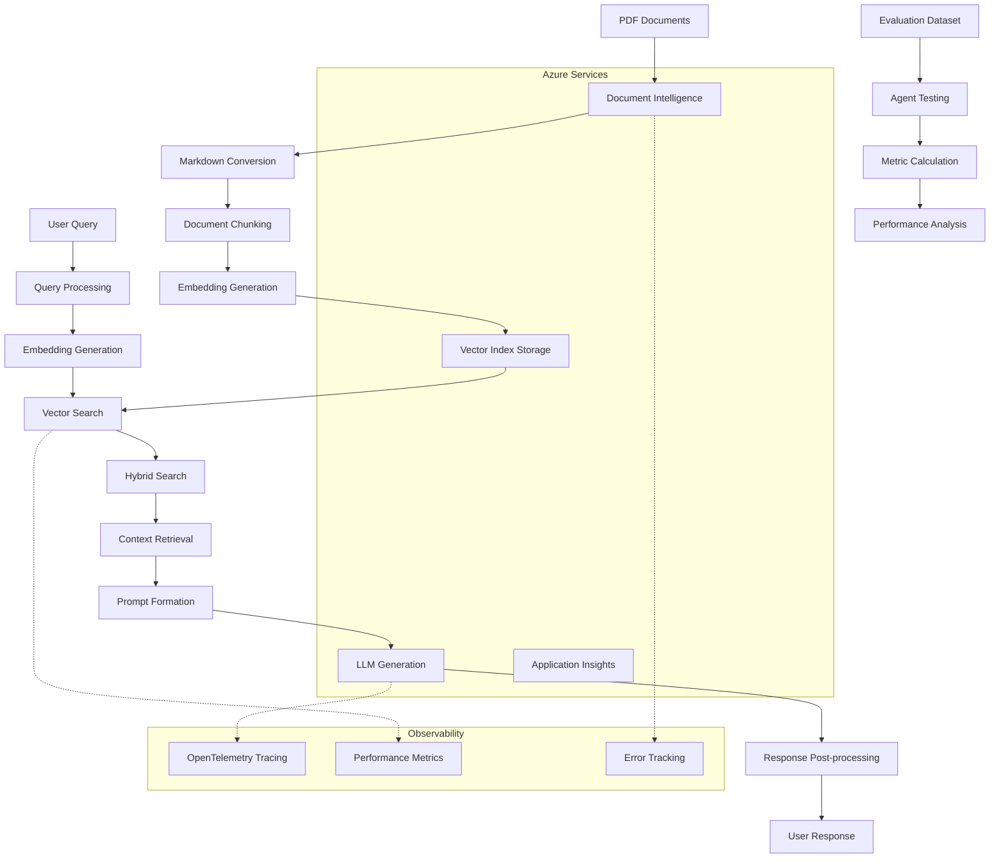
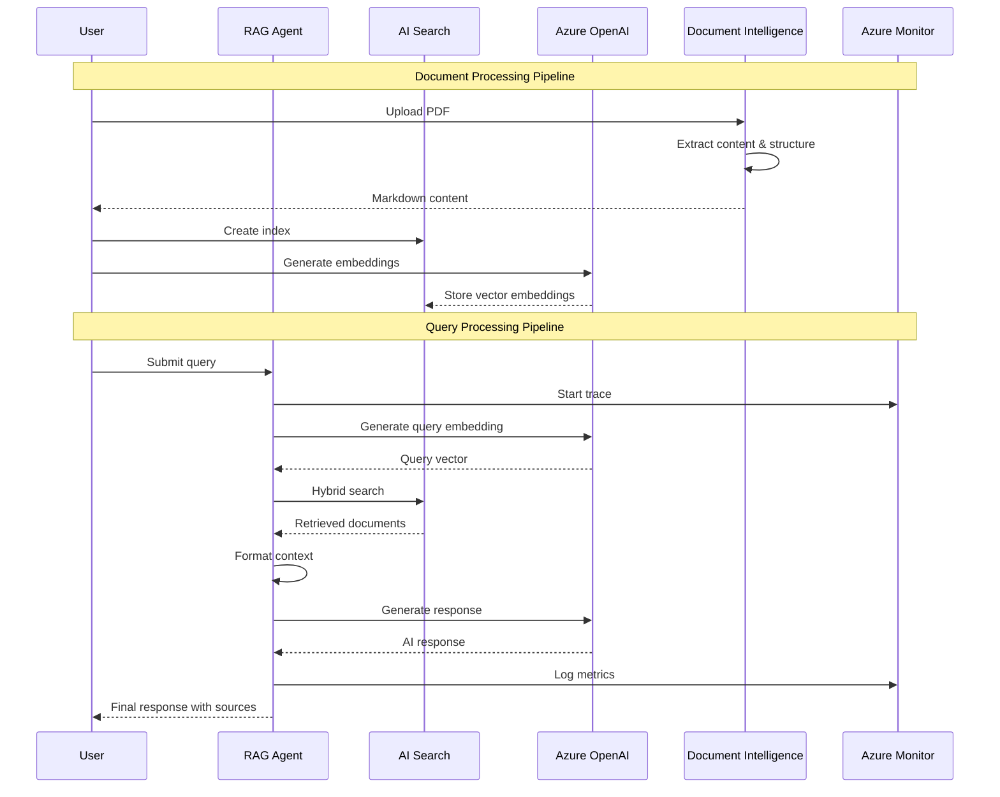

# Architecture Guide

This document provides a comprehensive overview of the Azure AI Foundry Workshop architecture, design patterns, and technical implementation details.

## Table of Contents

- [System Overview](#system-overview)
- [Architecture Diagram](#architecture-diagram)
- [Component Architecture](#component-architecture)
- [Data Flow](#data-flow)
- [Security Architecture](#security-architecture)
- [Scalability and Performance](#scalability-and-performance)
- [Design Patterns](#design-patterns)
- [Integration Patterns](#integration-patterns)
- [Deployment Architecture](#deployment-architecture)

## System Overview

The Azure AI Foundry Workshop implements a production-ready **Retrieval-Augmented Generation (RAG)** architecture using Azure AI services. The system demonstrates enterprise-grade patterns for intelligent document processing, semantic search, and AI agent orchestration.

### Core Principles

- **Modularity**: Each component is independent and can be developed, tested, and deployed separately
- **Observability**: Comprehensive tracing and monitoring throughout the pipeline
- **Scalability**: Designed to handle production workloads with Azure cloud services
- **Security**: Implements Azure security best practices and responsible AI controls
- **Maintainability**: Clean code architecture with comprehensive documentation

### High-Level Architecture

```
┌─────────────────────────────────────────────────────────────────┐
│                        User Interface Layer                     │
├─────────────────────────────────────────────────────────────────┤
│                      Application Layer                          │
│  ┌─────────────────┐  ┌─────────────────┐  ┌─────────────────┐ │
│  │   RAG Agent     │  │   Evaluation    │  │   Observability │ │
│  │    Service      │  │    Framework    │  │    & Tracing    │ │
│  └─────────────────┘  └─────────────────┘  └─────────────────┘ │
├─────────────────────────────────────────────────────────────────┤
│                      Integration Layer                          │
│  ┌─────────────────┐  ┌─────────────────┐  ┌─────────────────┐ │
│  │  Document       │  │   AI Search     │  │   Azure AI      │ │
│  │ Intelligence    │  │   Service       │  │   Foundry       │ │
│  └─────────────────┘  └─────────────────┘  └─────────────────┘ │
├─────────────────────────────────────────────────────────────────┤
│                      Infrastructure Layer                       │
│  ┌─────────────────┐  ┌─────────────────┐  ┌─────────────────┐ │
│  │  Azure OpenAI   │  │ Azure Monitor   │  │  Azure Storage  │ │
│  │    Service      │  │ & App Insights  │  │     Account     │ │
│  └─────────────────┘  └─────────────────┘  └─────────────────┘ │
└─────────────────────────────────────────────────────────────────┘
```

## Architecture Diagram

### RAG Pipeline Architecture



### Component Interaction Diagram



## Component Architecture

### 1. Document Intelligence Module (`docintel/`)

**Purpose**: Convert PDF documents to structured Markdown format

**Components**:
- `pdf-2-md.py`: Main conversion script using Azure Document Intelligence
- Supports both local files and HTTP URLs
- Implements table extraction and formatting
- Page-based content organization

**Key Features**:
- **Layout Analysis**: Uses `prebuilt-layout` model for comprehensive document analysis
- **Table Conversion**: Extracts tables and converts to Markdown format
- **Page Segmentation**: Maintains page boundaries with delimiter markers
- **Error Handling**: Robust error handling for various document types

```python
# Architecture pattern: Service-oriented design
class DocumentProcessor:
    def __init__(self, endpoint: str, credential: str):
        self.client = DocumentIntelligenceClient(endpoint, credential)
    
    def process_document(self, source: str) -> str:
        # Single responsibility: document processing
        pass
```

### 2. AI Search Module (`aisearch/`)

**Purpose**: Create and manage search indexes with vector capabilities

**Components**:
- `create_search_index.py`: Index creation with vector field support
- `ingest_documents.py`: Document processing and ingestion pipeline

**Architecture Patterns**:
- **Index Schema Design**: Optimized for hybrid search (keyword + vector)
- **Batch Processing**: Efficient document ingestion with configurable batch sizes
- **Vector Configuration**: HNSW algorithm for high-performance vector search

```python
# Architecture pattern: Factory pattern for search operations
class SearchIndexFactory:
    @staticmethod
    def create_vector_index(name: str, dimensions: int) -> SearchIndex:
        # Factory method for index creation
        pass

class DocumentIngestor:
    def __init__(self, search_client: SearchClient):
        self.search_client = search_client
    
    def ingest_documents(self, documents: List[Document]) -> None:
        # Batch processing with retry logic
        pass
```

### 3. RAG Agent Module (`agents/rag/`)

**Purpose**: Implement RAG workflow with Azure AI Agent Service

**Key Architecture Features**:
- **Agent Service Integration**: Uses Azure AI Agent Service SDK for managed orchestration
- **Connection-based Configuration**: Leverages Azure AI Foundry project connections
- **Built-in Tool Integration**: Native Azure AI Search tool integration
- **Session Management**: Automatic conversation thread management

**Design Patterns**:
```python
# Architecture pattern: Facade pattern
class RAGAgentService:
    def __init__(self, project_endpoint: str, search_index_name: str):
        self.project_client = AIProjectClient(endpoint=project_endpoint)
        self.agent_client = self.project_client.agents
        self._setup_search_connection()
    
    def ask(self, query: str) -> RAGResponse:
        # Facade method that orchestrates the full RAG pipeline
        # 1. Create or retrieve conversation thread
        # 2. Submit query with search tool enabled
        # 3. Process tool calls and responses
        # 4. Return formatted response with sources
        pass
```

### 4. Evaluation Framework (`agents/evaluations/`)

**Purpose**: Comprehensive evaluation of RAG agent performance

**Architecture**:
- **Local Evaluation**: Direct evaluation using Azure AI Evaluation SDK
- **Cloud Evaluation**: Scalable cloud-based evaluation via Azure AI Foundry
- **Multi-metric Assessment**: Groundedness, Relevance, Completeness, Intent Resolution

**Design Patterns**:
```python
# Architecture pattern: Strategy pattern for evaluation methods
class EvaluationStrategy:
    def evaluate(self, query: str, response: str, context: str) -> float:
        pass

class GroundednessEvaluator(EvaluationStrategy):
    def evaluate(self, query: str, response: str, context: str) -> float:
        # Specific evaluation logic
        pass

class RAGAgentEvaluator:
    def __init__(self, strategies: List[EvaluationStrategy]):
        self.strategies = strategies
    
    def evaluate_dataset(self, dataset: List[DataPoint]) -> EvaluationResults:
        # Strategy pattern application
        pass
```

### 5. Observability and Tracing

**Purpose**: Comprehensive monitoring and observability

**Components**:
- **OpenTelemetry Integration**: Auto-instrumentation for OpenAI and HTTP requests
- **Azure Monitor**: Centralized logging and metrics collection
- **Custom Spans**: Business logic tracing for RAG operations

**Architecture Patterns**:
```python
# Architecture pattern: Decorator pattern for tracing
from opentelemetry import trace

tracer = trace.get_tracer(__name__)

def trace_operation(operation_name: str):
    def decorator(func):
        def wrapper(*args, **kwargs):
            with tracer.start_as_current_span(operation_name) as span:
                # Add operation-specific attributes
                result = func(*args, **kwargs)
                # Log success metrics
                return result
        return wrapper
    return decorator

class RAGAgent:
    @trace_operation("rag_agent.retrieve_documents")
    def retrieve_documents(self, query: str) -> List[Document]:
        # Traced retrieval operation
        pass
```

## Data Flow

### 1. Document Processing Flow

```
PDF Input → Document Intelligence → Markdown → Chunking → Embeddings → Index Storage
    ↓              ↓                  ↓          ↓           ↓            ↓
  Validation   Structure         Page Split   Vector      Storage    Search Ready
              Extraction        Processing   Generation  Optimization
```

**Detailed Steps**:
1. **Input Validation**: Check file format, size, accessibility
2. **Content Extraction**: Use Azure Document Intelligence for layout analysis
3. **Structure Processing**: Convert tables, maintain page boundaries
4. **Content Chunking**: Split into searchable segments with overlap
5. **Vector Generation**: Create embeddings using Azure OpenAI
6. **Index Storage**: Store in Azure AI Search with hybrid search support

### 2. Query Processing Flow

```
User Query → Query Processing → Vector Search → Context Retrieval → Response Generation
     ↓             ↓              ↓              ↓                 ↓
 Validation   Embedding        Hybrid         Context          LLM Processing
             Generation       Search         Formation         & Post-processing
```

**Detailed Steps**:
1. **Query Validation**: Input sanitization and validation
2. **Query Embedding**: Generate vector representation of user query
3. **Hybrid Search**: Combine vector similarity and keyword search
4. **Context Formation**: Aggregate and format retrieved documents
5. **Prompt Construction**: Build context-aware prompts
6. **Response Generation**: Use Azure OpenAI for answer generation
7. **Post-processing**: Format response, extract citations

### 3. Evaluation Flow

```
Test Dataset → Agent Execution → Response Collection → Metric Calculation → Analysis
     ↓             ↓                ↓                    ↓                 ↓
 Data Prep    Batch Processing   Result Storage     Multi-metric       Performance
             & Error Handling                      Evaluation         Reporting
```

## Security Architecture

### Authentication and Authorization

**Azure Identity Integration**:
- **DefaultAzureCredential**: Seamless authentication across environments
- **Managed Identity**: For Azure-hosted deployments
- **Service Principal**: For automated CI/CD scenarios
- **Developer Authentication**: Azure CLI for development

### Security Layers

1. **Network Security**:
   - HTTPS-only communication
   - Virtual Network integration support
   - Private endpoint connectivity

2. **Data Security**:
   - Data encryption in transit and at rest
   - Azure Key Vault integration for secrets
   - Secure credential management

3. **Application Security**:
   - Input validation and sanitization
   - Rate limiting and throttling
   - Error handling without information leakage

### Responsible AI Controls

```python
# Content filtering and safety measures
class ResponsibleAIGuards:
    def __init__(self):
        self.content_filter = AzureOpenAIContentFilter()
        self.prompt_shield = PromptShield()
    
    def validate_input(self, query: str) -> bool:
        # Input validation with safety checks
        pass
    
    def validate_output(self, response: str) -> bool:
        # Output filtering and validation
        pass
```

## Scalability and Performance

### Horizontal Scaling Patterns

1. **Stateless Design**: All components are stateless for easy scaling
2. **Async Processing**: Support for concurrent request processing
3. **Batch Operations**: Efficient bulk processing capabilities
4. **Connection Pooling**: Optimized Azure service connections

### Performance Optimization

```python
# Performance patterns implemented
class PerformanceOptimizations:
    def __init__(self):
        self.connection_pool = ConnectionPool()
        self.cache = ResponseCache()
        self.rate_limiter = RateLimiter()
    
    async def process_batch(self, items: List[Item]) -> List[Result]:
        # Concurrent processing with rate limiting
        semaphore = asyncio.Semaphore(10)  # Limit concurrent requests
        tasks = [self.process_item(item, semaphore) for item in items]
        return await asyncio.gather(*tasks)
```

### Monitoring and Metrics

- **Response Time Tracking**: End-to-end performance monitoring
- **Throughput Metrics**: Request processing rates
- **Error Rate Monitoring**: Failure detection and alerting
- **Resource Utilization**: Azure service consumption tracking

## Design Patterns

### 1. Facade Pattern
**Used in**: RAG Agent Service
**Purpose**: Simplify complex interactions with multiple Azure services

### 2. Factory Pattern
**Used in**: Search index creation, client initialization
**Purpose**: Abstract object creation logic

### 3. Strategy Pattern
**Used in**: Evaluation framework
**Purpose**: Support multiple evaluation strategies

### 4. Observer Pattern
**Used in**: Tracing and monitoring
**Purpose**: Decouple observability from business logic

### 5. Builder Pattern
**Used in**: Prompt construction, search query building
**Purpose**: Construct complex objects step by step

## Integration Patterns

### 1. API Gateway Pattern
```python
# Central point for service integration
class AzureServiceGateway:
    def __init__(self):
        self.search_client = self._create_search_client()
        self.openai_client = self._create_openai_client()
        self.doc_intel_client = self._create_doc_intel_client()
    
    def route_request(self, service: str, operation: str, **kwargs):
        # Route requests to appropriate services
        pass
```

### 2. Circuit Breaker Pattern
```python
# Resilience pattern for external service calls
class CircuitBreaker:
    def __init__(self, failure_threshold: int = 5, recovery_timeout: int = 60):
        self.failure_threshold = failure_threshold
        self.recovery_timeout = recovery_timeout
        self.failure_count = 0
        self.state = "CLOSED"  # CLOSED, OPEN, HALF_OPEN
    
    def call(self, func, *args, **kwargs):
        # Circuit breaker logic
        pass
```

### 3. Retry Pattern
```python
# Exponential backoff for transient failures
@retry(
    stop=stop_after_attempt(3),
    wait=wait_exponential(multiplier=1, min=4, max=10),
    retry=retry_if_exception_type(ServiceRequestError)
)
def call_azure_service(self, *args, **kwargs):
    # Service call with automatic retry
    pass
```

## Deployment Architecture

### Development Environment
- **Local Development**: Direct Azure service integration
- **Development Containers**: Consistent development environment
- **VS Code Integration**: Comprehensive debugging and development tools

### Production Environment
```yaml
# Example Azure Resource Architecture
Resources:
  - Azure AI Foundry Hub
  - Azure AI Foundry Project
  - Azure AI Search Service (Standard tier)
  - Azure OpenAI Service (GPT-4o, text-embedding-3-small)
  - Azure Document Intelligence Service
  - Azure Application Insights
  - Azure Key Vault
  - Azure Storage Account

Network:
  - Virtual Network integration
  - Private endpoints for services
  - Network Security Groups
  - DDoS protection

Security:
  - Managed Identity assignments
  - RBAC role assignments
  - Key Vault integration
  - Azure Security Center monitoring
```

### CI/CD Pipeline Architecture
```yaml
# Deployment pipeline stages
Stages:
  1. Code Quality:
     - Linting (flake8, black, isort)
     - Type checking (mypy)
     - Security scanning
  
  2. Testing:
     - Unit tests
     - Integration tests
     - Performance tests
     - Evaluation tests
  
  3. Build:
     - Docker image creation
     - Dependency management
     - Configuration validation
  
  4. Deployment:
     - Infrastructure provisioning (Terraform/ARM)
     - Application deployment
     - Configuration management
     - Health checks
```

### Monitoring and Observability Architecture

```python
# Comprehensive observability stack
Observability:
  Metrics:
    - Custom metrics (response time, accuracy scores)
    - Azure service metrics
    - Business KPIs
  
  Logging:
    - Structured logging with correlation IDs
    - Azure Application Insights integration
    - Log aggregation and analysis
  
  Tracing:
    - OpenTelemetry distributed tracing
    - End-to-end request tracking
    - Performance bottleneck identification
  
  Alerting:
    - Azure Monitor alerts
    - Performance threshold monitoring
    - Error rate alerting
    - Automated incident response
```

This architecture provides a robust, scalable, and maintainable foundation for enterprise RAG applications using Azure AI services. The modular design enables teams to develop, test, and deploy components independently while maintaining system coherence and reliability.